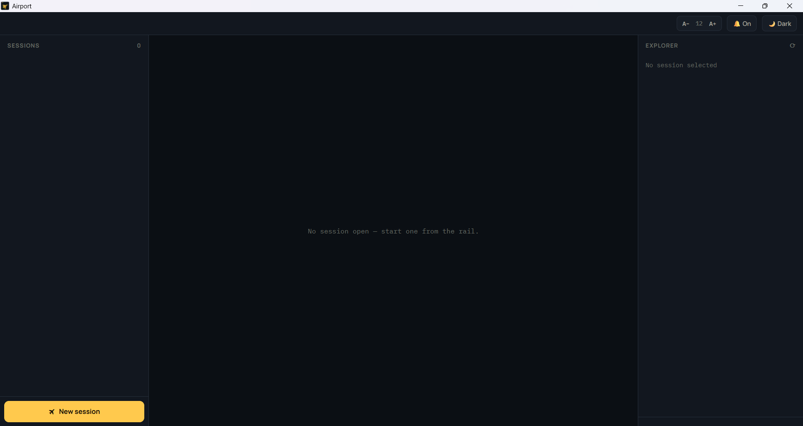
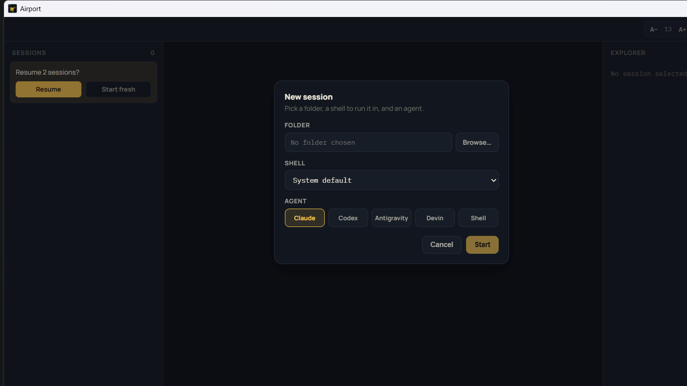

# ✈️ Airport

**Run Claude Code, Codex, Devin, and other AI coding agents side by side — without losing track of who needs you.**

If you've ever had several terminal tabs open for several different AI agents and had no idea which one is waiting on your answer, which one is still thinking, and which one finished five minutes ago — Airport fixes that.



## Why Airport

Running multiple AI coding agents at once is powerful, but plain terminal tabs give you zero signal about what's happening inside them. Airport turns your terminal tabs into a work queue, with every session showing a live status:

- 🔴 **Needs you** — the agent is blocked on a question or a permission prompt
- 🟡 **Working** — the agent is thinking or running a tool, no action needed
- 🟢 **Done** — the agent finished its turn and is waiting for your next instruction
- ⚪ **Exited** — the session ended

The sessions that need you are called out at a glance, so you always know where to look next.

## Features

- **One place for every agent** — Claude, Codex, Antigravity, Devin, or a plain shell, each in its own real terminal, side by side.
- **At-a-glance status** — colour, an icon, and a count in the toolbar tell you what needs attention, so it's still readable in a screenshot or for colorblind users.
- **Desktop notifications** — get pinged the moment a session needs your input, even if Airport isn't the focused window.
- **Built-in file explorer** — every session shows the git branch and changed files for its folder, without switching to your editor.
- **Resume where you left off** — close the app and reopen it later; Airport offers to reopen your previous sessions.
- **Light & dark themes.**

### Starting a new session

Pick a folder, a shell, and an agent — Airport wires everything up for you.



## Download

Grab the latest build for your platform from the [Releases page](https://github.com/vignaesh01/airport/releases):

- **Windows** — download the `.zip`, extract it, and run `Airport.exe`.
- **macOS** — download the `.zip`, extract it, and open `Airport.app`.
- **Linux** — download the `.tar.gz`, extract it, and run the `Airport` binary.

Airport is a free, independent tool and the builds aren't code-signed, so your OS will likely flag it the first time you run it:

- **Windows (SmartScreen):** click **"More info"** → **"Run anyway"**.
- **macOS (Gatekeeper):** right-click the app → **Open** → confirm in the dialog. (If it still refuses, run `xattr -cr Airport.app` in Terminal first.)

### If your antivirus or browser blocks the download entirely

Some antivirus tools and browsers are extra cautious about unsigned executables and may block the download or refuse to run it. If that happens, you can build Airport yourself instead:

1. Install [Node.js](https://nodejs.org/) (LTS version). On Linux, also install a C/C++ toolchain (`build-essential`, `python3`) — one of Airport's dependencies compiles from source there.
2. Clone this repository:
   ```sh
   git clone https://github.com/vignaesh01/airport.git
   cd airport
   ```
3. Install dependencies and build:
   ```sh
   npm install
   npm run build
   npx electron .
   ```

This runs Airport directly from source on your machine, with nothing downloaded but the code itself.

## Requirements

- Windows, macOS, or Linux
- The AI coding agents you want to run (Claude Code, Codex, etc.) installed and working from your regular terminal first — Airport runs them, it doesn't replace them.

## Feedback & issues

Found a bug or have an idea? Open an issue on the [GitHub repository](https://github.com/vignaesh01/airport/issues).
